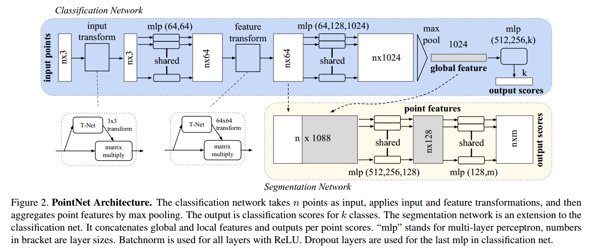
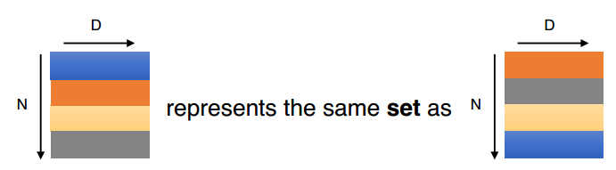
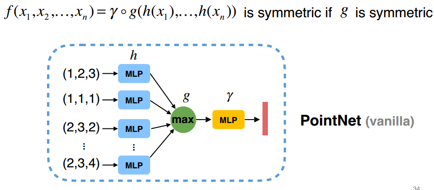
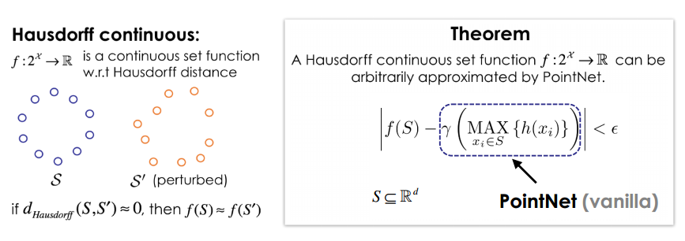

# summary of PointNet

this a **pioneering and key** paper on applying deep learning(DL) on point clouds since it **firstly opens doors to novel 3d-centric approaches to 3D scene understanding** with the perspertive of DL. The proposed net named PointNet enables feature learning directly on point cloud data. Surprisingly, most of the later papers in this area since 2017 are largely influenced by it and many of them even design new nets directly based on the pointnet, for example, Charles Qi's later papers including PointNet++, F-PointNet, VoteNet.

## background

- point cloud data(PCD) is an important geometric data structure with numerous apps in robotics, autonomous driving, AR/VR, AEC/FME, surveying, etc; **However, PCD is quite different from other formats(e.g: mesh, volumentric, multi-view images), it has some particular characteristics:** 1)irregular; While pixels in images or voxels in volumentric are regular which distribute evenly in the space, PCD is a irregular format which has no fixed distribution pattern in the space. 2) orderless(point member permutation invariance), rigid tranformation invariance and interaction among points; PCD is orderless, and has rigid tranformation invariance and each point member is not isolated, instead neighboring points form a meanningful subset.

- geometric data structures comparison; mesh, volumetric, multi-view images, and point cloud. refer to Charles's thesis ch01,02 for comparision details.
  
- gap; For leveraging DL, PCD is often converted to other formats(eg: volumetric, multi-view imgs, mesh) since **typical convolutional architectures require highly regular input data formats like image grids, 3d voxels**. However, this will result in problems and issues.
  >volumetric,unncessarily voluminous since most lidar point cloud only has surface points and also computation inefficent when dealing with 3d cnn; mesh, need to decide mesh structures,eg: triangules, quad,etc; multi-view images, need to decide from which angles to generate the images so that the model can have a good performance, info loss.

## proposal

- proposal; to fill the gap, a novel deep neural network that directly consumes point cloud dubbed PointNet is proposed; This net is designed with respecting properties of PCD which are the permutation invariance of points and rigid transformation invariances of the object.
  >Note: PointNet does not capture local structure of PCD; Instead, it either processes on 1 point(MLP operation) or all points(max pooling operation).As a result, this results in its main limitation: no learning on local context. PointNet++ is proposed to overcome this.) 
  >It provides a **unified and lightweighted** approach to a number of 3D recognition tasks including object classification, part segmentation and semantic segmentation

- PointNet unique characteristics;1)consume PCD directly as the input; 2)respect permutation invariance of points and rigid tranformation invariance(this actually is not important). 3)robust to data corruption and pertubation. 4)can obtain S.T.O.A performance(2016). 5) various PCP tasks(classi, semantic segmentation).

- limiataion; not tailored to the property: interaction between points, not be able to capture local context.

## key components and its architecture
### key components

There are mainly 3 key modules inclduing max pooling module, conctenation structure and T-Net.; 1) max pooling module to aggragate info from all the points. (ensure `point member permuatation invariance`.) 2) concatenation structure combining local and global info (enable semantic segmentation). 3) 2 joint networks named T-Net.(ensure `rigid tranformation invariance`)

### achitecture

- input and output; 1) For classification, NxD(1 object N points, each with D dims) --> label (1 class,eg: table). 2) for part seg, NxD(1 object N points, each with D dims and each obj has many parts) --> labels (each point have a label,eg: table leg, table plane,etc.). 3)for semantic seg, NxD(1 sub-volumn sampled from a scene,e.g: 1x1 block from a scene) --> labels (each point have a label,eg: table, chair, sofa,etc.).

- architecture;

 

  - T-Net;
  - concatenation of local and global info;
  - Tensor shape envolvement in 4d format(for verification, you can visualize it in tensorboard); 
  
  - The architecture has lots of similarities with typical convolutional NNs but it **has a special preference for point/depth convolution** namely 2d convolution with 1x1 kernels; ( *TODO: 2d conv mainly abstract features across space, while 2d conv w. 1x1 kernels abstract features across channels. Check the intuition of point conv from `Network in network` and `Xception` paper*)

## [optional] methodology

## results

omitted, check the paper.

## code analysis

## critiques and comments

## FAQ

### Among all popular geometric data structures, why point cloud data is favored?

- (TODO) The popular geometric data structures involve mesh, volumetric, multi-view images, and PCD; Except PCD, all those formats have their limitations. 1)for mesh, it is hard to define a particular TIN and quadrangles for DL task. 2)for volumetric, on the one hand, it is computationally expensive for apply 3d cnn(O(n^3)); On the other hand, there will 'a hole' representation when converting PCD to volumentric data meanning that most of the voxels are on the surface of the objects. Evidently, this is not suitable for PCD data. 3) regarding multi-view image representation, it is difficult to define the directions for project PCD into images.
    >volumetric,unncessarily voluminous since most lidar point cloud only has surface points and also computation inefficent when dealing with 3d cnn; mesh, need to decide mesh structures,eg: triangules, quad,etc; multi-view images, need to decide from which angles to generate the images so that the model can have a good performance, info loss.

- PCD is representationally simple; close to raw data which enables end-to-end learning.

### what are learned by PointNet?

Interestingly, PointNet learns a discriminative feature/representation/embedding for each input which is a set of critical interesting points, rougly corresponding to the skeleton of the input. Specifically, this representation is quite informative and robust for representing the input PCD. For example, table points(Nx3) --PointNet--> 1024 vector,later on this representation(1024 vector) can be used to perform classificaiton and segmentation task.

### how does PointNet respect the point cloud data permutation invariance?

PointNet smartly uses a symmetry function(Pointnet(vanilla)) to realize;

- The designed net needs to be invariant to N! permutations.
  

- Luckily, a symmetry function like add, sum and pooling(max,avg) operation and PointNet(vanilla) can achieve this effect.

-  In PointNet, the author exquistitely construct a symmetry function named PointNet(vanilla) which is composed of MLP, max-pooling and another MLP. Specially, each point in the input will use MLP to be convolved into a high-dimensional point, then pooling is adopted over all points to obtain a global descriptor. finally, use another MLP to digest the global descriptor to perform classifification task. **Obviously, the permutation invariance can be achieved when using a pooling operation.**

## how the PointNet(vanilla) is designed?

above img is the pontnet(vannila) structure.

- if using the simplest form(eg:max or avg pooling), evidently the resulted info is not a good representation of the whole PC data; either a fartheest point or a point roughly in the centroid of the PC data.

- use the point vanilla comprised of 3 parts, h, g, gamma; This is the key part of this paper, how the author manages to propose such an tricky framework is based on this prototype.
  - 1)use MLP(h)-CNN for each point to generate a high-dim redundant info since **the following aggregation step in the (redundant) high-dim space can preserve interesting properties of the geometry**; `BN1C`
  - 2)then aggragate all pts using max/avg pooling, this can still preserve a discrimintive representation and insteresting info for all pts/the geo;`B11C`

  - 3)then use another mlp(r)-fully connected layers to digest the info, hopefully we can do the classi and seg applications.  
  - 4)PointNet vanilla is just a special case of the symmetric function set;you can use a therem to prove that the point vanilla can approximate any functions.

## ideas

- can I propose a special net tailored for the seg ?
- can I use kervolutional ideas on point cloud data?

## references

PointNet
PointNet++
Charles QI's Ph.D. thesis