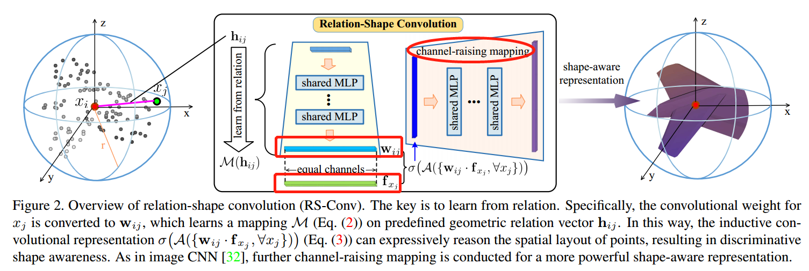
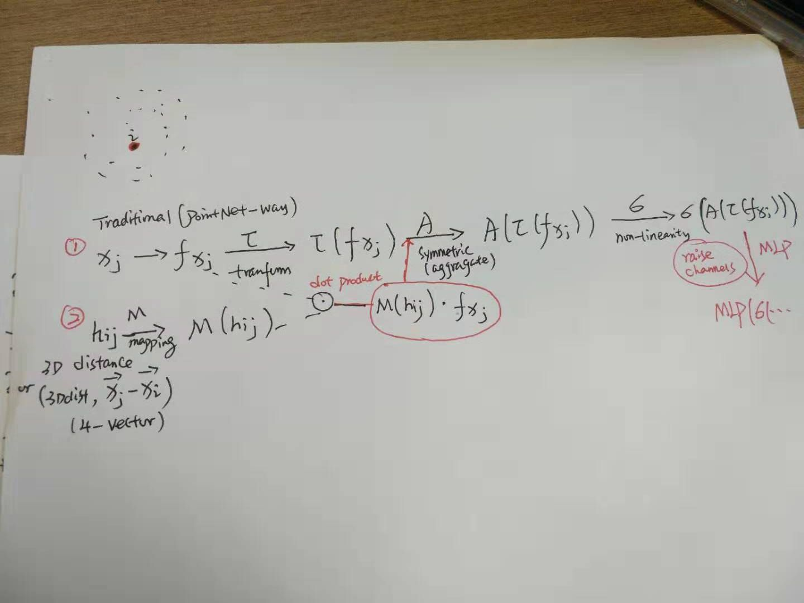
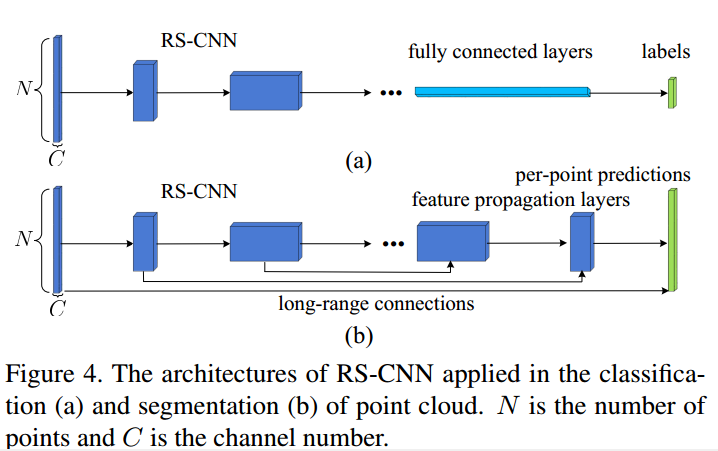

# Relation-Shape CNN

## main proposals

- RS-Conv;a convolution operator which is comprised of 2 parts: learning from relations and channel-wise mapping.

  - step1: learning from relations(the key part); h_ij is a vector defining the relation between j and i(can often represent as a 3D euclidean distance or high-dimensinal vector,e.g: 4-vector(3Ddis,x_i-x_j)). Then, a mapping M approximated by a MLP will be used over h_ij to obtain w_ij. Then w_ji will convolve f_x_j(the feature of x_j) to get a high dimensional vector. Then an aggragating symmetric function like max pooling A will be used to guranteen the permutation invariance followed by a non-linear function like relu or sigmoid.( **check the above formula for better understanding ,focus on the difference with pointnet way.**)
  - step2: channel-wise mapping; for increasing the channels, another MLP will be used on the results of step1.

- RS-CNN;the achitecture is quite similar to PointNet++ except that it uses the RS-Conv as the operator to learn the shape-aware representation which is more inductive of the spatial layout of the irregular points.

## questions
### how the 3 properties of PCD is respected?

- A; permutation invariance;
- M(h); robust to rotation and translation when a good h is defined;
- h_ij,M; interaction between points;

### about shape-aware representation
refelct the spatial layout of pts, more inductive/representative.

### difference between RS-CNN and pointnet++
rs-conv operator which can obtain discriminatively inductive encoding for the irregular pts.

## key components and its architecture

- **learning from relations** to **encode more meaningful shape info** in PCD, i.e., the geometric topology constraint among points.
- a more distinctive rep with much more shape awareness and robustness
- context shape-aware learning for PC anaylsis

## intro
- PCD has drawn wide atteniton with many application like autonomous driving and AR. However, this task is challenging since it is difficult to **infer the underlying shape formed by these irregular points**.
- previous works; convert PCD to other formats(voxels, multi-view images).
- PointNet is impressive but has limitation in capturing local structures; PointNet++ introduces heirarchical learning into pointnet, and SPG uscyinac@connect.ust.hke superpoint to solve this limitation. But all these techniques extremely relies on effective inductive learning of loacal subsets which is quite intractable to achieve.
- 3 challenges for learning from point set P; 1)permutation of point members invariance, 2)robust to rigid tranformation, 3)of discriminative shape awareness.

- 

- By convolute in this way, we can gain:1)**an inductive/discriminative w. explicit reasoning about the spatial layout of points**. 2) invariance to points permuation and robust to rigid tranformation. 3)contexual shape-aware learning.

- the key contributions;1)a learn-from-relation conv operator named **relation-shape convolution**; 2)a deep heirarchical net composed of relation-shape convolutions, i.e., RS-CNN. 3)extensive experiments with empirical and theoretical analysis.

## results

### qualitative results

### quantitative results

## code analysis
well written and neat.
