[TOC]

# RandLA-Net: Efficient Semantic Segmentation of Large-Scale Point Clouds

## Abstract

- logic: research problem-->gap-->proposal and core components-->empirical experiments

- research problem: investigate on the problem of **efficient semantic seg. for lg-scale PCs**

- current issue/gap: most of the current approaches can only handle sm-scale PCs due to either the expensive sampling process or the computationally heavy pre-processing step

- proposal: a new neural architecture for semantic seg. task for lg-scale PCs which the author thinks is efficient and lightweight.

- core components: 1) the key to this approach is **random pt sampling (RS)** --> remarkably computation and memory efficient **but discard key features by chance**, 2) **local feature aggregation module** which **progressively increase the receptive field for each 3D point, thereby effectively preserving geometric details**  --> to overcome the issue of key features discarding

- empirical experiments: 1)it is super fast( more than200x faster when 1 million points in a single pass) compared, 2)gain STOA performance on two large-scale benchmarks Semantic.3D reduce8 and SemanticKITTI

## 1.Introduction

- Justification of eff. sem. seg. for lg-scale PCs: a fundamental and essential capability for realtime intelligent systems, such as autonomous driving and augmented reality

- key challenges of PCs: the raw point
clouds acquired by depth sensors are typically **irregularly sampled, unstructured and unordered**

- gap: DL can not be directly applied to PCs due to its characteristics which are quite diff. from image data.

- literature review
  - a pioneering work PointNet capable of learning point-wise features using MLPs but fails to capture wider local info for each pt.
  - To learn richer local structures, **many dedicated neural modules have been subsequently and rapidly introduced**.
  - These papers can be summarize as 4 categories: 1) neighbouring feature pooling, 2) graph message passing, 3) kernel-based convolution, and 4) attention based aggregation.
  - limitations for these papers: 1)most of them only handle/process extremely small 3D point clouds (e.g., 4k points or 1×1 meter blocks), 2)and cannot be directly extended to larger point clouds (e.g., millions of points and up to 200×200 meters) without **preprocessing steps such as block partition**
  - 3 reasons for this limitation: 1) point-sampling methods are either computationally expensive or memory inefficient, 2)feature learners rely on computationally expensive kernelisation or graph construction, 3)the existing local feature learners are either incapable of capturing complex structures, or do so inefficiently, due to their limited size of receptive fields
  - works tackling the task of lg-scale PCs: SPG,FCPN,PCT; Although they achieve decent semantic seg. results, the preprocessing and voxelization steps are too computationally heavy to be deployed in real-time applications

- aim: design a memory and computationally efficient neural architecture, which is able to directly process large-scale 3D point clouds in a single pass, without requiring any pre/post-processing steps such as voxelization, block partitioning or graph construction.

- core components: random sampling (RS) and local feature aggregation (LFA)
  - RS; a key enabler for deep neural networks to efficiently process large-scale point clouds but **can discard key information, especially for objects with sparse points.**
  - LFA; To counter the potentially detrimental impact of RS, LFA is proposed to **capture complex local structures over progressively smaller point-sets**. Specially, comprised of 3 units: 1)a local spatial encoding (LocSE) unit to explicitly preserve local geometric structures, 2)rather than max/avg pooling, here use attentive pooling to automatically keep the useful local features, 3)stack multiple LocSE units and attentive poolings as a dilated residual block, greatly increasing the effective receptive field for each point.

- Amazing performance of this net: 1) up to 200× faster on lg-scale PCs, 2)surpasses the STOA sem. seg. methods on both Semantic3D and SemanticKITTI benchmarks.

- contrib: 1)analyze and compare existing sampling methods and then identify random sampling as the suitable method for lg-scale PCs, 2)a newly feature aggregation module which is capable of **learning/capturing/preserving complex local context/structures** by progressively increasing the receptive field for each pt,3) STOA performance on two lg-scale benchmarks while also it is significant memory and computation saving.

## 2.Related work

- Projection and Voxel Based Networks.
- Point Based Networks
- Learning for Large-scale Point Clouds

## 3.RandLA-Net
### overview

- down-sampling issue; Faced with lg-scale PCs spanning up to hundreds of meters, it is inevitable to down-sample PCs progressively and efficiently while preserving the useful point
features
- Basic idea of this net: use the simple and fast approach of random sampling to greatly **decrease point density**, whilst **applying a carefully designed local feature aggregator to retain prominent features**.

### sampling method comparison
- FPS
- IDIS
- RS
- GS
- CRS
- PGS

### local feature aggregation

This LFA module is applied on **each pt in parallel** and consists of 3 units: **local spatial encoding(LocSE), attentive pooling(AP), dilated residual block(DRB)**.

- LocSE;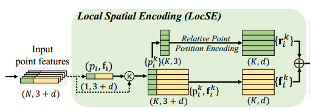
  - it explicitly *embed xyz coordinates of all nb pts such that the corresponding center point features are always aware of their relative spatial locations*. **This conforms to the intuition of sem. seg task that the semantic labels of each pt is determined by its nb pts within a range.--yc**
  - This allows to observe local geometric patterns, thus eventually to help the entire network to learn/capture the complex local structures.
  - 3 steps: 1) find nearest nb pts for each input pt using Euclidean distance KNN (later on, focus describe the steps on 1 pt), 2) relative pt position encoding `(r_i)^k` by concatenating pt's xyz, its nb pts, its Euclidean distance, and relative xyz position, then followed by a MLP, 3)point feature `F_i_hat` augmentation by concatenating relative pt pos. encoding (r_i)^k and its corresponding point features.
  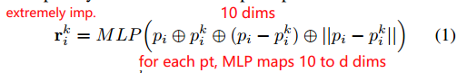
  - for 2nd step, an ablation study is conducted using different pt feature setting concatenation combination. It can be shown that this combination(pt+pt nb+rel xyz+distance) is better. 
  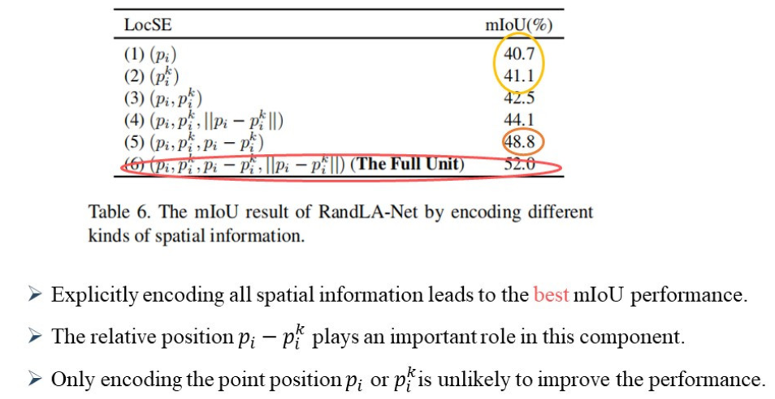
  - the output of LocSE is **a set of nb features  explicitly encoding the local geometric structures for the center point** `p_i`.

- AP;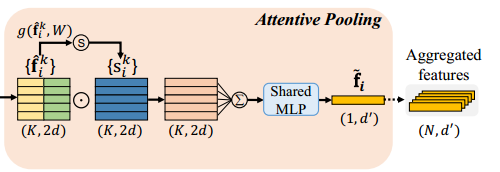
  - this unit is used to aggregate the nb pts(Note: previous works often use max/avg pooling, this might result in lots of info loss). Therefore, here AP is used which consists of two steps computing attention scores and weighted summation.
  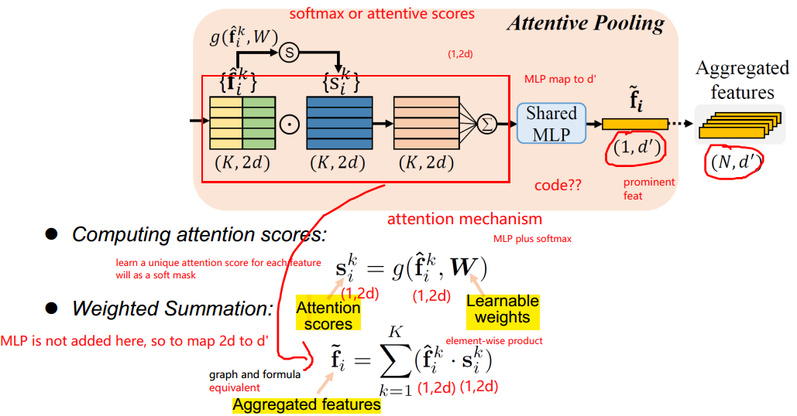
  - computing attention scores; a shared function
g() to learn a unique attention score for each feature is designed to obtain the attention scores as a soft mask to automatically selecting imp. features. g() is made up of a MLP and a softmax function.
  - weighted summation;check the above fig. for the weight summation details.
  - **AP here is quite sim. to sum pooling,but with a attention score matrix to weight.--yc**
  - An ablation study is conducted using different pooling methods including max,mean,sum pooling. note: the below fig also involve other ablation study such as remove local spatial encoding and simplify dilated residual block.
  
  - to conclude, given the input point cloud P , for the ith point `p_i`, the LocSE and AP units learn to aggregate the geometric patterns and features of its K nearest points, and finally generate an informative feature vector `~f_i` called **an aggregated feature**.

- DRB;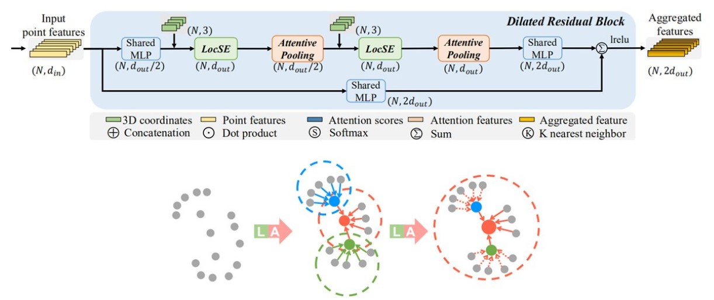
  - inspired by the ResNet and the effective dilated networks, the DRB is made up of **several sets of LocSE and AP unit stack** with a skip connection. 
  - dilating the receptive fields; the red 3D point observes K nb points after the first LocSE/Attentive Pooling operation, and then is able to receive information from up to K2 neighbouring points i.e. its two-hop neighbourhood after the second.
  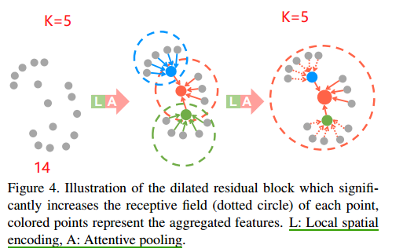
  - how many sets of LocSE and AP stack?Theoretically, the more units we stack, the more powerful this block as its sphere of reach becomes greater and greater. However, more units would inevitably sacrifice **the overall computation efficiency**. In addition, the entire network is likely to be **over-fitted**. The paper choose 2 as the number.
  - An ablation study on the number of set of LocSE and AP stacking in the block show that 2 sets of LocSE and AP stacking is better.
  

- summary
  - LFA is designed to **effectively preserve complex local structures via explicitly considering nb geometries and significantly increasing receptive fields**. 
  - Moreover,**computationally efficient** since only MLPs in the neural structure.

### implementation

- RandLA-Net is implemented by stacking multiple LFA modules and random sampling layers. the architecture is like below fig.
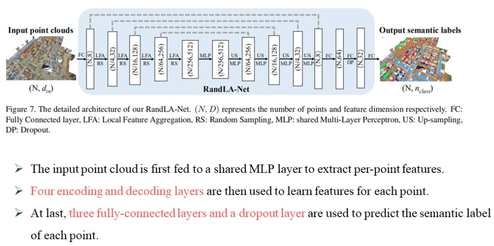
- encoder-decoder structure, then 3 FC layers w. dropout to predict semantic labels for each pt.

## 4.Experiments

### Efficiency of Random Sampling
- RS is the most suitable sampling method for lg-scale PCs.
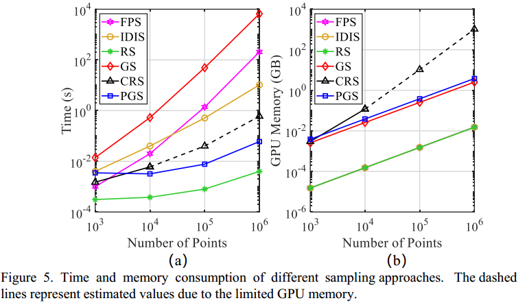

### Efficiency of RandLA-Net
- super fast 
- lg inference pts in a single forward pass.
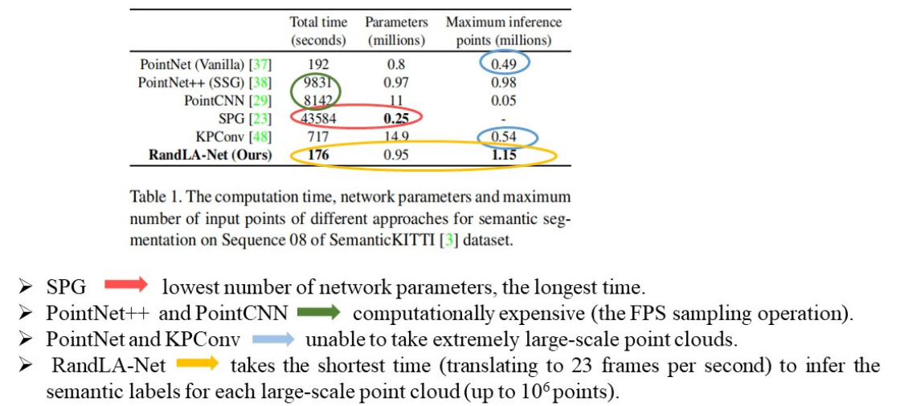

### STOA performance on several benchmarks 
- Semantic.3D
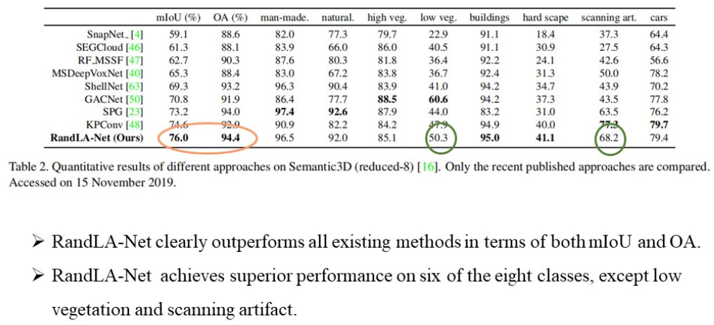
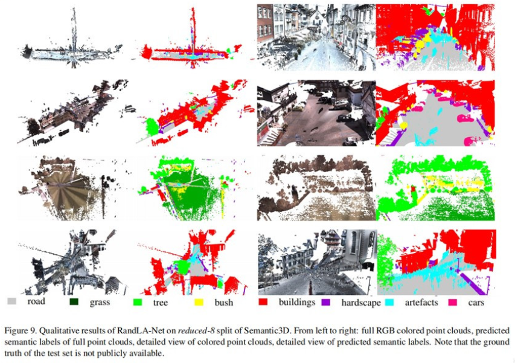
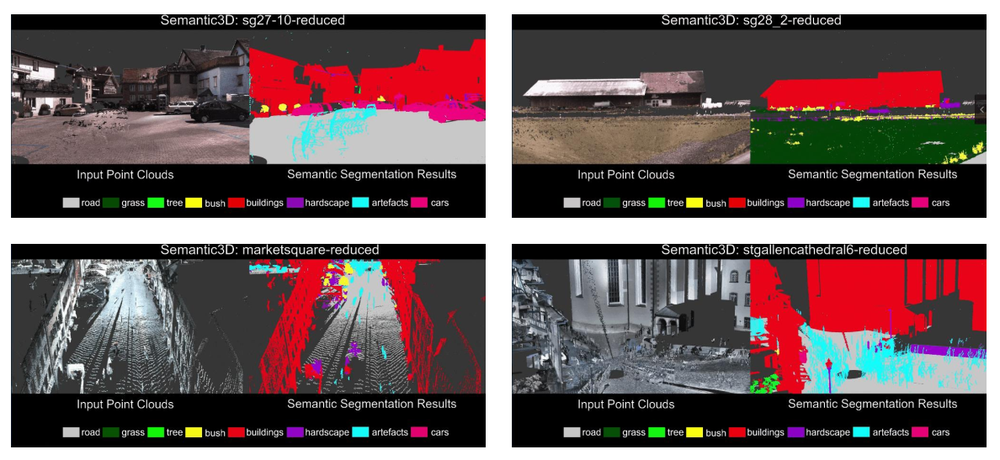

- SemanticKITTI
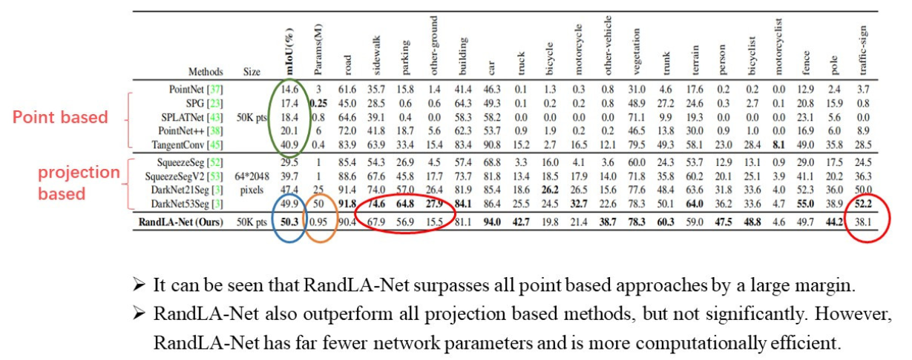
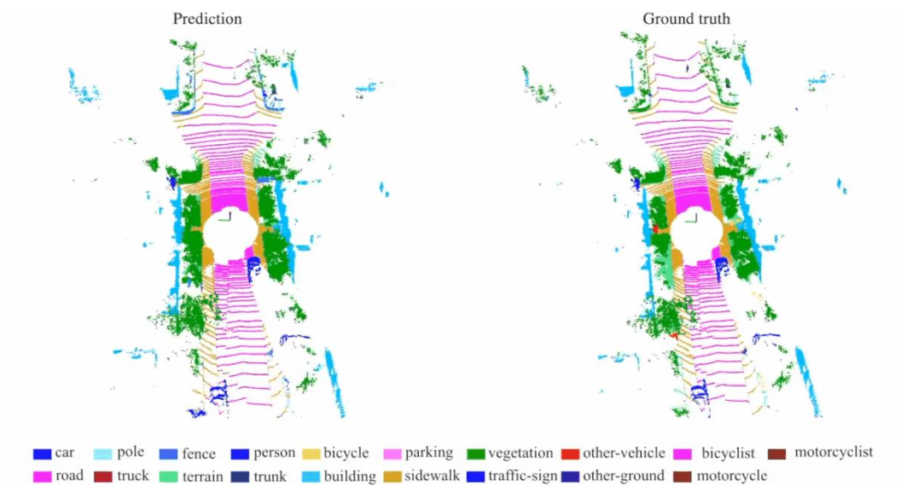
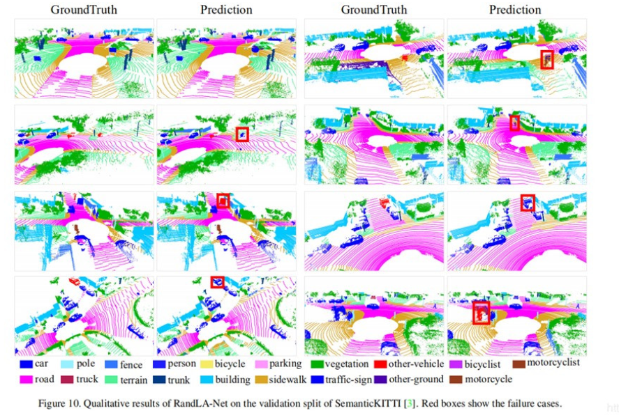

- S3DIS
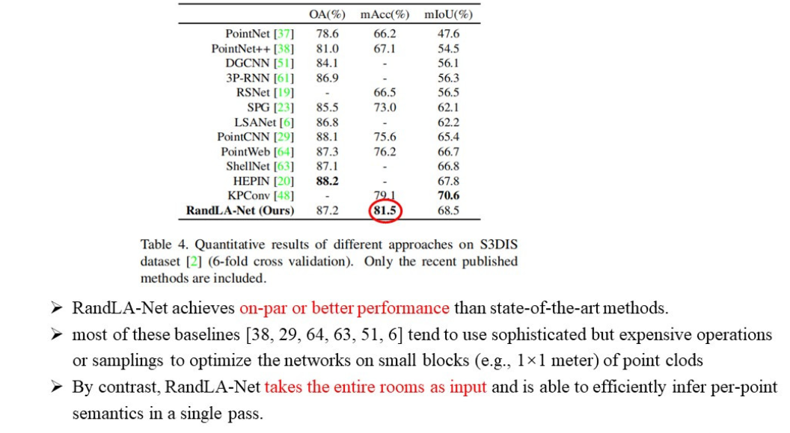
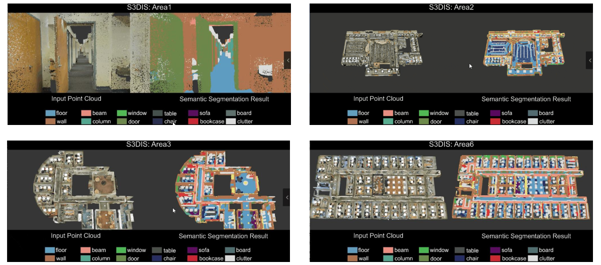

## 5.Conclusion

## References (important)
TODO

## my comments and summary

### my curious question on this paper before reading

Questions:
- RandLA?  Random, Local feature Aggragator
- efficient? yep, quite eff., 200x than SPG
- how lg?  semantic.3D and semantiKITTI benchmark ds
- comp w. STOA? slightly better than KPConv

### summary

### Idea

- relative pt position encoding, can we add other types of distance, e.g.: L1 distance, L2 distance? 